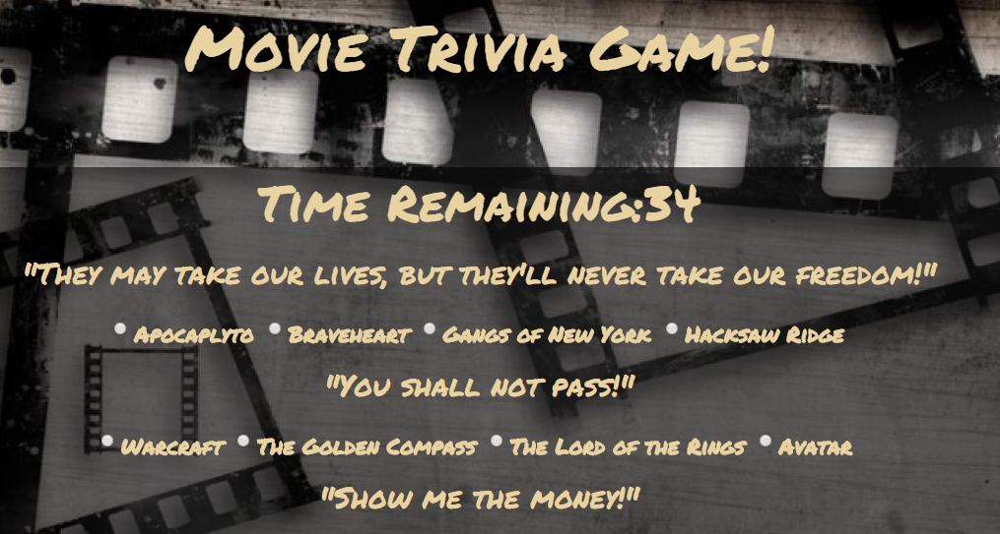
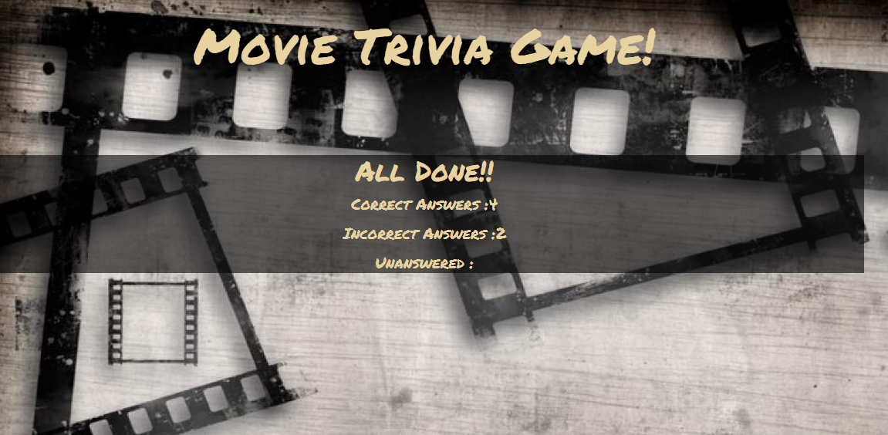

# TriviaGame
### Created a trivia game app using JavaScript, jQuery, HTML, Bootstrap and CSS.

* Created a trivia form with multiple choice options.
* Player has limited amount of time to complete quiz.

  * Game ends when time is up or submit buttton is clicked!! 
  * Number of incorrect and correct guesses revealed.

  
  
 
